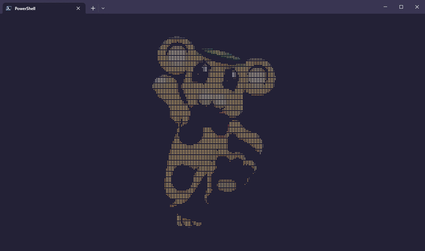

# UniGreet
* A simple Image to Unicode converter, that can be used as a terminal-greeter

    

## Table of Contents
* [Notes](#Notes)
* [Usage](#Usage)
* [Installation](#Installation)

## Notes
* It supports 2 different character sets: BRAILLE, BLOCK
* You need a Terminal and Font that allows Unicode-Characters
* most terminals support color escape sequences, if you get weird results use flag --nocolor
* on Windows It is recommended to use the "Windows Terminal" app, as it allows for Unicode Characters and RGB colors

## Usage
* ``python ./unigreet.py <file> [FLAGS]``
* use -h / --help to see all available flags

## Installation
* For the Python version you need the "pillow" package
    * ``python -m pip install pillow``

## WIP
* C Version
* add ASCII Charset
